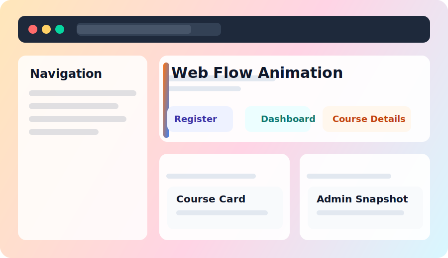
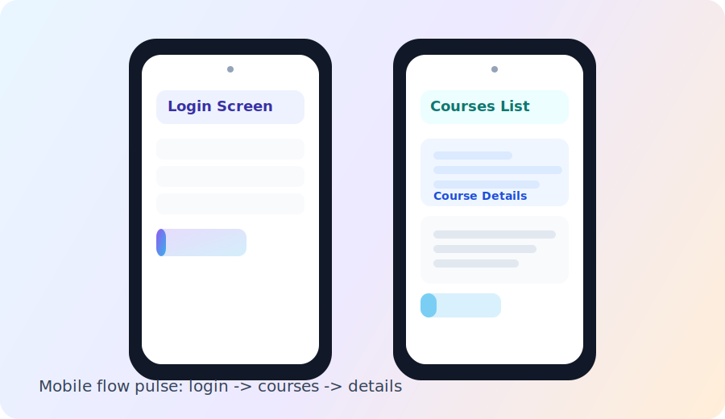

<p align="center">
  
</p>

<p align="center">
  <b>Full-stack LMS capstone for SoftUni "Full Stack Apps with AI"</b>
</p>

<p align="center">
  <a href="https://nextjs.org/"></a>
  <a href="https://expo.dev/"></a>
  <a href="https://www.typescriptlang.org/"></a>
  <a href="https://orm.drizzle.team/"></a>
  <a href="https://neon.tech/"></a>
</p>

<p align="center">
  
  
  
  
</p>

<p align="center">
  <a href="#animated-showcase"></a>
  <a href="#progress-roadmap"></a>
  <a href="#quick-setup"></a>
  <a href="#project-details"></a>
</p>

## Animated Showcase

- Live Web App: `TBD`
- Mobile Demo (Expo): `TBD`
- Video Walkthrough: `TBD`

<table>
  <tr>
    <td width="50%" valign="top">
      <h3>Web App Preview</h3>
      
      <p>Animated SVG flow for register -> dashboard -> course details.</p>
    </td>
    <td width="50%" valign="top">
      <h3>Mobile App Preview</h3>
      
      <p>Animated SVG flow for login -> courses -> details.</p>
    </td>
  </tr>
</table>

## Progress Roadmap

`MVP delivery pulse: [###.......] 13% (1/8 phases complete)`

| Phase | Scope | Status |
|---|---|---|
| Phase 0 | Monorepo bootstrap |  |
| Phase 1 | DB schema + Drizzle migrations |  |
| Phase 2 | Auth + JWT guards |  |
| Phase 3 | Courses/modules/materials CRUD + favorites |  |
| Phase 4 | Profile + admin panel |  |
| Phase 5 | Mobile API integration |  |
| Phase 6 | Deployment (Vercel/Netlify) |  |
| Phase 7 | Docs + demo polish |  |

## Project Details

<details open>
  <summary><b>Project Story</b></summary>

StudyHub v2 is a full rewrite of StudyHub v1 with a modern full-stack architecture.
The goal is a rubric-first LMS that ships clean backend security, responsive web UI, and mobile parity.
</details>

<details>
  <summary><b>Stack and Architecture</b></summary>

| Layer | Technology |
|---|---|
| Frontend Web | Next.js + React + TypeScript + Tailwind CSS |
| Backend API | Next.js API Routes (RESTful) |
| Database | Neon PostgreSQL + Drizzle ORM |
| Auth | JWT (register/login/logout) + role-based access |
| Mobile | React Native + Expo |
| Shared | Monorepo package for common TypeScript types/utils |

```text
capstone/
|- apps/
|  |- web/        # Next.js web client + API
|  |- mobile/     # Expo app
|- packages/
|  |- shared/     # Shared TypeScript types
|- drizzle/       # Schema + migrations
|- docs/          # Assignment + implementation notes
|- AGENTS.md
`- README.md
```
</details>

<details>
  <summary><b>Feature Scope</b></summary>

MVP:
- JWT auth with server-side checks
- Roles (`user`, `admin`) with admin guards
- Courses -> modules -> materials hierarchy
- Favorites + activity logging
- Admin panel (users + moderation + logs)
- 7 responsive web screens
- 3 mobile screens

Optional after MVP:
- Cloudflare R2 uploads
- AI summarize/quiz/chat
- Notes + PDF export
- Contact flow
</details>

<details>
  <summary><b>Required Screens</b></summary>

Web (7):
1. Register
2. Login
3. Dashboard
4. Course Details
5. Material View/Edit
6. Profile
7. Admin Panel

Mobile (3):
1. Login
2. Courses List
3. Course Details
</details>

<details>
  <summary><b>Database and Security Baseline</b></summary>

Tables:
1. `users`
2. `courses`
3. `modules`
4. `materials`
5. `favorites`
6. `activity_logs`

Rules:
- Every schema change is shipped with a Drizzle migration
- Server-side JWT validation for protected routes
- Server-side admin role validation for admin actions
- No sensitive data in error payloads
- Input sanitization before rendering
- TypeScript strict mode
- Tailwind-based styling for web UI
</details>

<details>
  <summary><b>API Overview</b></summary>

Auth endpoints:
- `POST /api/auth/register`
- `POST /api/auth/login`
- `POST /api/auth/logout`
- `GET /api/auth/me`

Core endpoints:
- Courses CRUD
- Modules CRUD
- Materials CRUD
- Favorites create/list/remove

Admin endpoints:
- Users list / role update / delete
- Materials moderation
- Activity logs
</details>

## Quick Setup

Requirements:
- Node.js 20+
- npm 10+

Install:
```bash
npm install
copy .env.example .env
```

Run web:
```bash
npm run dev:web
```
Open: `http://localhost:3000`

Run mobile:
```bash
npm run dev:mobile
```

Alternative mobile connection modes:
```bash
npm run dev:mobile:tunnel
npm run dev:mobile:lan
```

## Demo Credentials

| Role | Email | Password |
|---|---|---|
| Admin | admin@studyhub.dev | admin123 |
| User | user@studyhub.dev | user123 |

## v1 -> v2 Transformation

| Topic | StudyHub v1 | StudyHub v2 |
|---|---|---|
| Frontend | Vanilla JS | React + Next.js + TypeScript |
| Backend | Supabase-centric | Next.js API + Neon + Drizzle |
| Mobile | None | React Native + Expo |
| Structure | Single app style | Monorepo + shared package |

## Notes

- Legacy repository is used only as visual/logical reference.
- No Vanilla JS code is copied into this project.
