<div align="center">
  
</div>

<p align="center">
  <b>Full-stack LMS capstone for SoftUni "Full Stack Apps with AI"</b>
</p>

<p align="center">
  <a href="https://nextjs.org/"></a>
  <a href="https://expo.dev/"></a>
  <a href="https://www.typescriptlang.org/"></a>
  <a href="https://orm.drizzle.team/"></a>
  <a href="https://neon.tech/"></a>
</p>

<p align="center">
  
  
  
  
  
  
  
</p>

<p align="center">
  <a href="#system-architecture"></a>
  <a href="#database-schema"></a>
  <a href="#user-roles"></a>
  <a href="#demo-walkthrough"></a>
  <a href="#api-endpoints"></a>
</p>

---

## Live Demo

- Live Web App: `TBD` (deployment planned as final phase)
- Mobile Demo (Expo): local only — see [Quick Setup](#-quick-setup)

Demo credentials: see [Demo Credentials](#demo-credentials)

## Product Preview

<table>
  <tr>
    <td width="50%">
      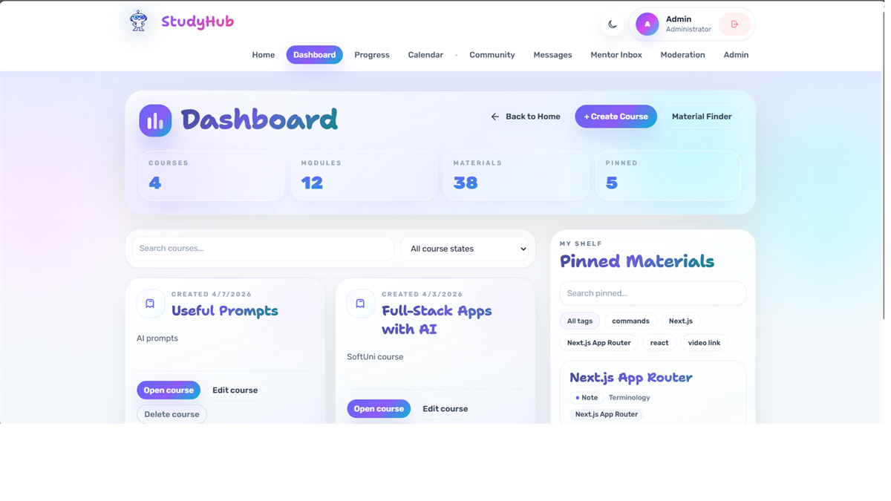
      <br />
      <sub><b>Dashboard</b> - course overview and quick access</sub>
    </td>
    <td width="50%">
      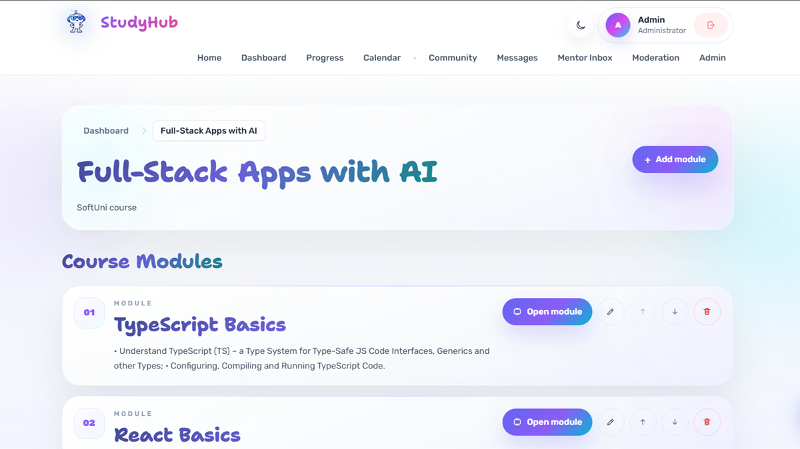
      <br />
      <sub><b>Course workspace</b> - modules and study structure</sub>
    </td>
  </tr>
  <tr>
    <td width="50%">
      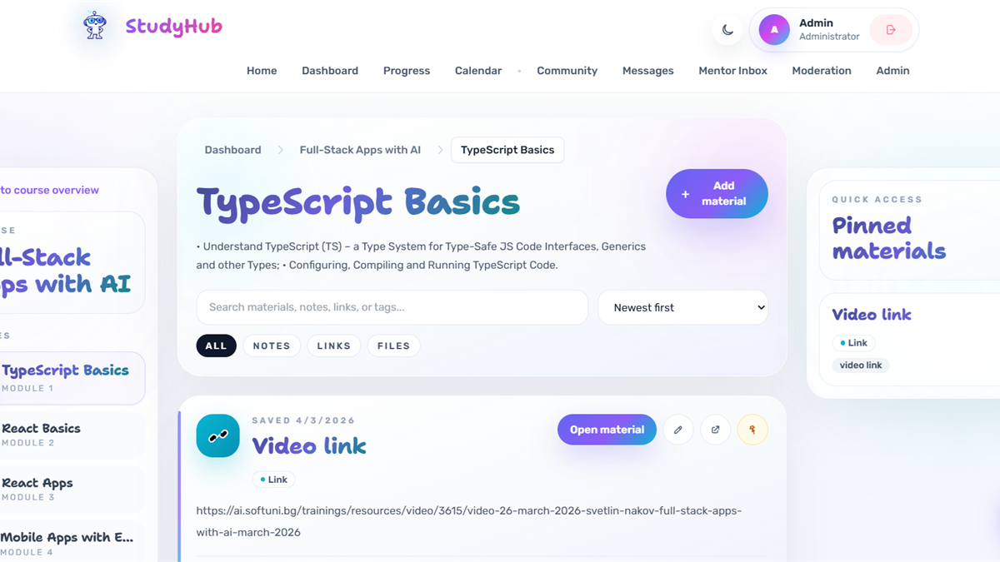
      <br />
      <sub><b>Materials</b> - organized notes, links, and learning resources</sub>
    </td>
    <td width="50%">
      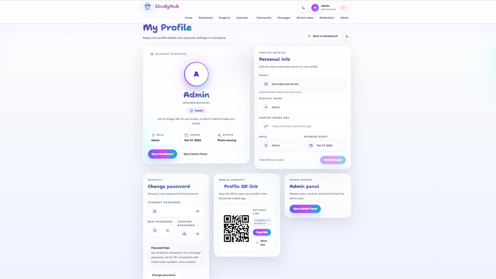
      <br />
      <sub><b>Profile</b> - account details, security, and mobile handoff</sub>
    </td>
  </tr>
</table>

## Contact Email Delivery

The public Contact page sends real messages through a server-side Next.js API route. Submitted messages are delivered to the configured contact inbox via Nodemailer/Gmail SMTP, while `Reply-To` is set to the visitor email so admins can respond directly from Gmail.

<p align="center">
  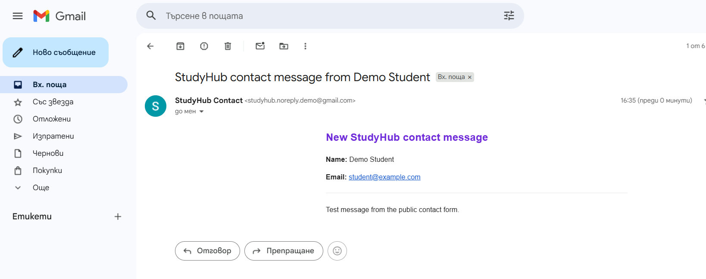
</p>

## Mobile Preview

<table>
  <tr>
    <td width="33%">
      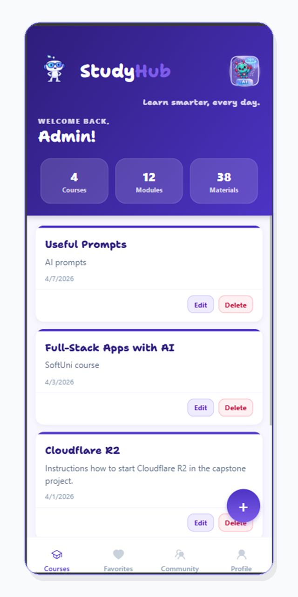
      <br />
      <sub><b>Courses</b> - mobile course overview</sub>
    </td>
    <td width="33%">
      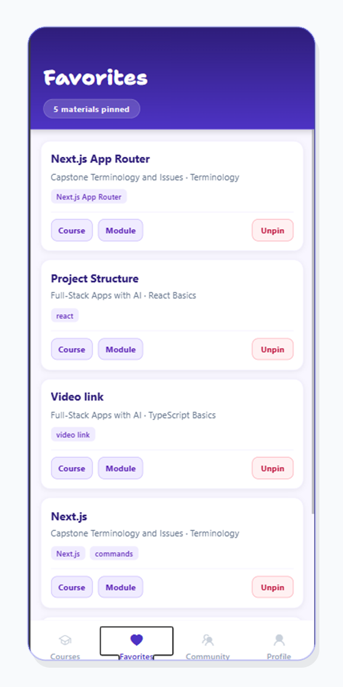
      <br />
      <sub><b>Favorites</b> - pinned study materials</sub>
    </td>
    <td width="33%">
      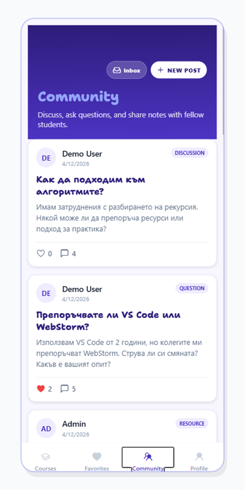
      <br />
      <sub><b>Community</b> - posts and discussions</sub>
    </td>
  </tr>
  <tr>
    <td width="33%">
      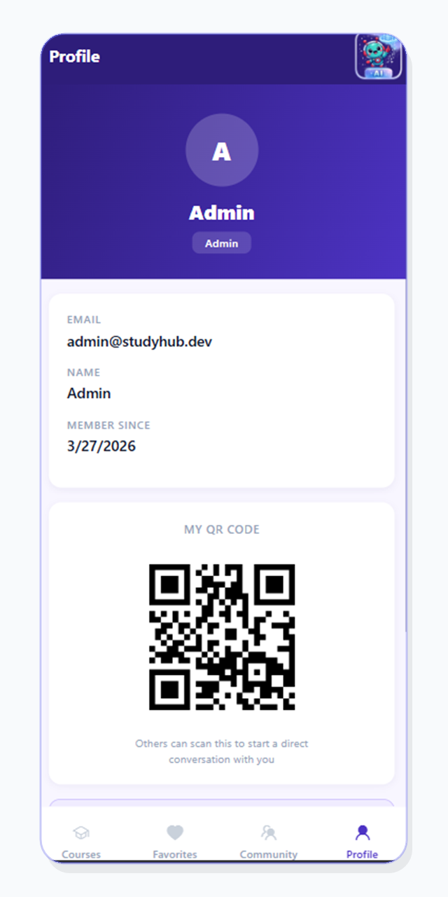
      <br />
      <sub><b>Profile</b> - account and logout</sub>
    </td>
    <td width="33%">
      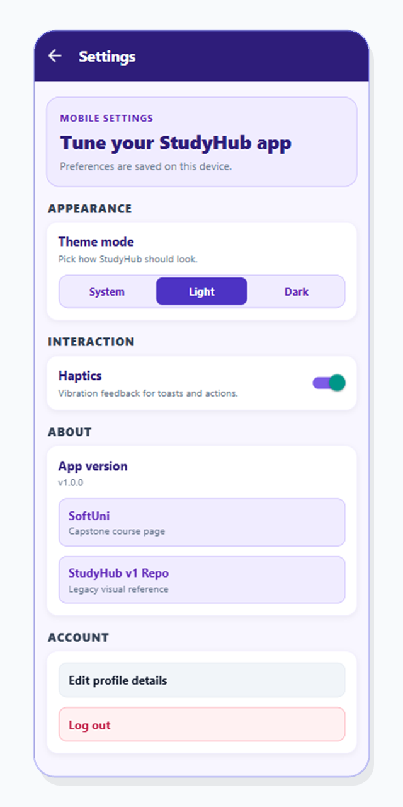
      <br />
      <sub><b>Settings</b> - preferences and theme</sub>
    </td>
    <td width="33%">
      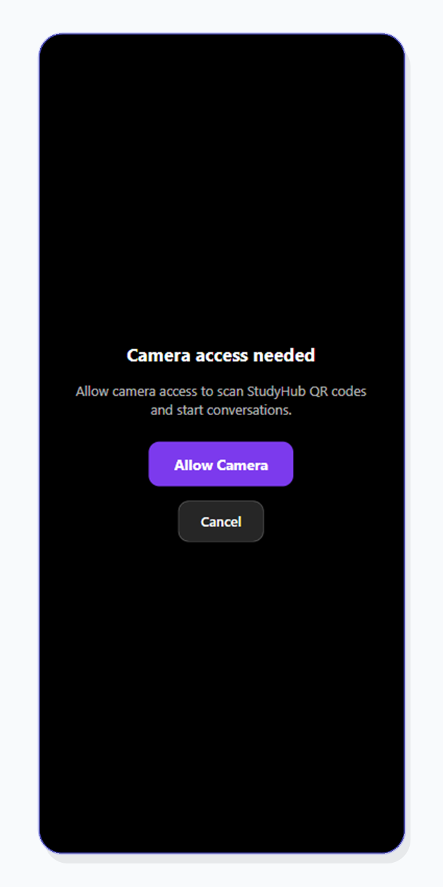
      <br />
      <sub><b>QR handoff</b> - profile deep link scan</sub>
    </td>
  </tr>
</table>

## Mobile Demo

<video src="https://github.com/user-attachments/assets/4af18559-7e62-4ce6-9d9a-f30d5bf6656e" controls width="320"></video>

---

## About the Project

StudyHub v2 is a full rewrite of [StudyHub v1](https://github.com/mariva565/Test-Capstone-Project-StudyHub) (Vanilla JS + Supabase) with a modern full-stack architecture: **Next.js + Expo monorepo**.

The app is a personal **Learning Management System (LMS)** — a structured electronic notebook where users organize study materials hierarchically (`Courses -> Modules -> Materials`), track progress with milestones, and plan with a calendar.

Most tools make you choose: Notion gives you flexibility but no structure. Google Classroom gives you structure but no AI. StudyHub brings all three together — a full LMS hierarchy, a social community board with direct messaging, and AI-powered study tools (quiz generation, summarization, smart search) — in a single platform built for learners who want to do more than just take notes.

**Why a rewrite instead of a new concept:**
- The business logic is personally useful — I actively use StudyHub to organize my own SoftUni notes and plan this capstone.
- Rebuilding the same domain with a completely different stack creates a direct comparison between two architectural approaches.
- StudyHub v1 had monolithic files that were too risky to refactor before submission. v2 corrects that from day one with modular components.
- Some interface patterns remain recognizable on purpose, but the implementation is fully rewritten. This is adaptation and redesign, not copying.

---

## Progress Roadmap

| Phase | Scope | Status |
|---|---|---|
| Phase 0 | Monorepo bootstrap (npm workspaces) |  |
| Phase 1 | DB schema + Drizzle migrations (21 tables) |  |
| Phase 2 | Auth (JWT + Google OAuth + role guards) |  |
| Phase 3 | Courses / modules / materials CRUD + favorites |  |
| Phase 4 | Profile + milestones + calendar + progress tracking |  |
| Phase 5 | Mobile app (CRUD flows + persisted React Query cache + Sentry telemetry validation + release checklist) |  |
| Phase 6 | Admin panel (user management, moderation, logs) |  |
| Phase 7 | AI study tools (Gemini chat, summarize, quiz) |  |
| Phase 8 | UI polish (landing, how-it-works, contact, animations) |  |
| Social S0 | Roles (user / mentor / admin) + Course Membership |  |
| Social S1 | Community Board — posts, comments, likes, bookmarks, moderation |  |
| Social S2 | Ask Mentor — Q&A workflow with Mentor Inbox |  |
| Social S3 | Messaging + notifications (web inbox/chat, mobile inbox/thread, browser + mobile push) |  |
| Phase 9 | File storage (Vercel Blob — avatar + material uploads) |  |
| Phase 10 | Deployment (Vercel/Netlify) |  |

---

## System Architecture

### Overview

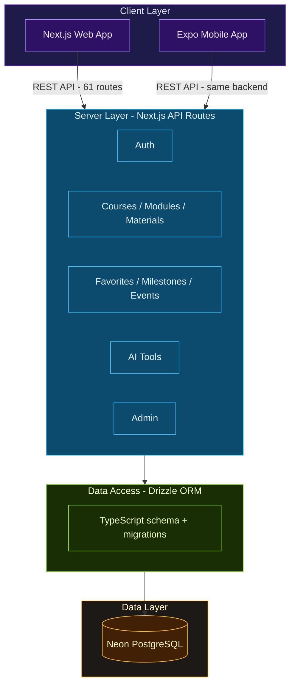

### Tech Stack

| Layer | Technology |
|---|---|
| Frontend Web | Next.js 15 + React 19 + TypeScript (strict) + Tailwind CSS |
| Backend API | Next.js API Routes — core + social + messaging route groups |
| Database | Neon PostgreSQL (serverless) + Drizzle ORM + SQL migrations (21 tables) |
| Auth | Custom JWT (jose, HS256, httpOnly cookies) + Google OAuth |
| Mobile | React Native + Expo SDK 54 + TanStack React Query + AsyncStorage persistence + Expo notifications |
| Monorepo | npm workspaces (`apps/web`, `apps/mobile`, `packages/shared`) |

---

## Authentication Flow

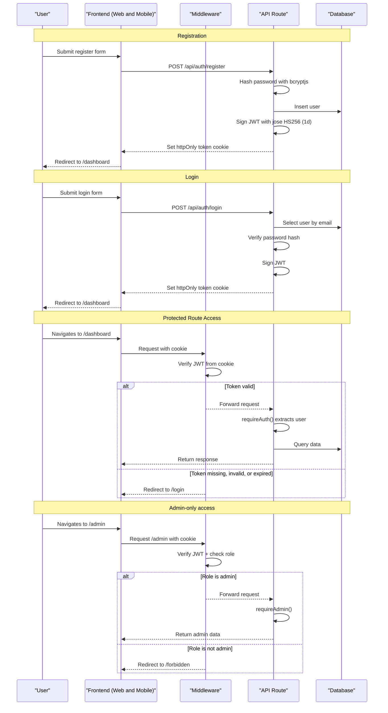

---

## Content Access Flow

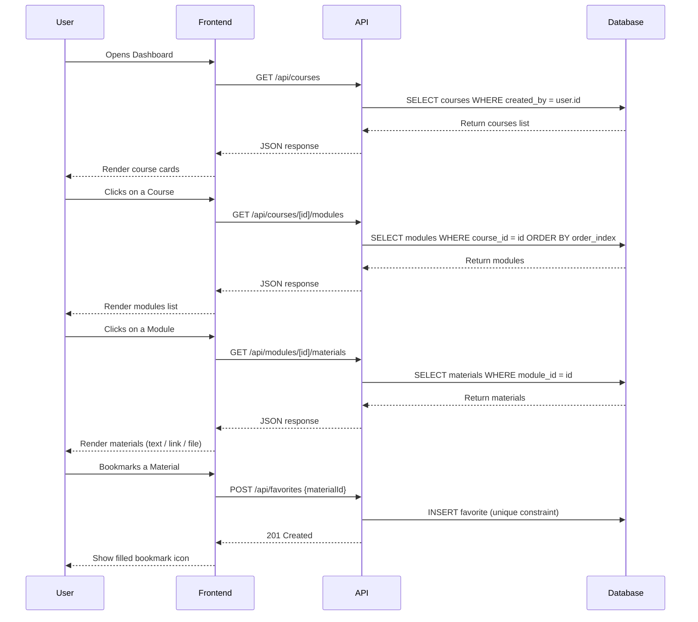

---

## User Roles

### Student (role: `user`)

| Action | Where |
|---|---|
| Register / login / logout | `/register`, `/login` |
| Create, edit, delete own courses | `/dashboard` |
| Create modules inside own courses | `/courses/[id]` |
| Create, edit, delete materials (text, link, file) | `/materials/[id]` |
| Bookmark materials as favorites | Any material card |
| Track progress with milestones | `/progress` |
| Plan with calendar events + weather widget | `/calendar` |
| Use Community rich-text posting (Tiptap) | `/community/new`, `/community/[id]/edit` |
| Read and write direct messages | `/messages`, `/messages/[id]` |
| Edit profile and avatar | `/profile` |

### Mentor (role: `mentor`)

| Action | Where |
|---|---|
| Everything a student can do | — |
| View questions from own courses in Mentor Inbox | `/mentor-inbox` |
| Filter questions by status (open / answered / closed) | `/mentor-inbox` |
| Mark questions as answered or close them | `/mentor-inbox` → inline status buttons |
| Answer questions via comments | `/community/[id]` |
| Assigned per-course via `course_members` table | Admin panel → Members tab |

### Admin (role: `admin`)

Everything a mentor can do, plus:

| Action | Where |
|---|---|
| View all users | `/admin` |
| Change user roles (user / mentor / admin) | `/admin` → Users tab |
| Delete users (with self-protection) | `/admin` → Users tab |
| Manage course members and mentor assignments | `/admin` → Members tab |
| View and delete any material | `/admin` → Materials tab |
| Approve / hide / pin community posts | `/admin` → Moderation tab |
| View activity logs (audit trail) | `/admin` → Activity Logs tab |

Admin cannot delete themselves or change their own role (self-protection enforced server-side).

### Platform scope per role

| Role | Web | Mobile |
|---|---|---|
| Student (`user`) | Full feature set | Full feature set |
| Mentor (`mentor`) | Full feature set + Mentor Inbox + moderation actions | Same as student — mentor-specific screens are web-only by design |
| Admin (`admin`) | Full feature set + Admin Panel (users, members, materials, moderation, activity logs) | Same as student — admin panel is web-only by design |

Mobile is intentionally scoped to the student experience. Mentor and admin workflows require larger tables, bulk actions, and moderation queues that are better suited to a desktop browser; roles are still recognized on mobile (profile badge, telemetry tag) but do not unlock additional UI.

---

## Database Schema

Current schema includes 21 tables with foreign key relationships, cascade deletes, and unique constraints.

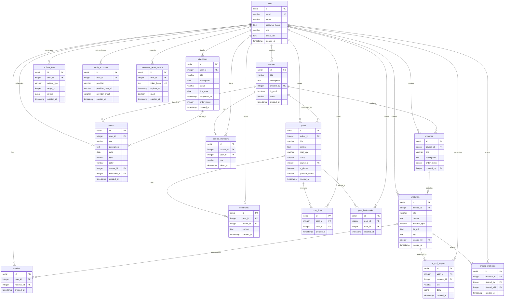

Additional tables in the current schema (shown in diagram above):
- `conversations`
- `conversation_members`
- `messages`
- `user_push_tokens`
- `password_reset_tokens`
- `shared_materials`

### Table Descriptions

| # | Table | Purpose | Key relationships |
|---|---|---|---|
| 1 | `users` | User accounts with email, hashed password, role (user/mentor/admin) | Referenced by almost all tables via `created_by` or `user_id` |
| 2 | `courses` | Top-level containers for learning content | Created by user; contains modules |
| 3 | `modules` | Ordered sections within a course | Belongs to course (cascade delete); contains materials |
| 4 | `materials` | Learning content — text notes, links, or files | Belongs to module (cascade delete); can be favorited |
| 5 | `favorites` | Bookmarked materials per user | Unique constraint on (user_id, material_id) prevents duplicates |
| 6 | `milestones` | Personal progress goals with status workflow | not_started -> in_progress -> done; linkable to calendar events |
| 7 | `events` | Calendar entries with type and color | Optionally linked to a course or milestone |
| 8 | `activity_logs` | Audit trail for all user actions | Stores action_type + structured JSON details |
| 9 | `ai_tool_outputs` | Saved AI analysis results (summaries, quizzes) | Per user + material; indexed for fast lookup |
| 10 | `oauth_accounts` | External auth provider identities | Links Google OAuth to user; unique on (provider, provider_user_id) |
| 11 | `course_members` | Course membership + per-course mentor assignments | Unique (course_id, user_id); role: student or mentor |
| 12 | `posts` | Community Board posts (discussions, questions, resources, articles) | Linked to author and optionally to a course; supports pinning + moderation |
| 13 | `comments` | Flat comment threads on posts | Belongs to post (cascade delete); linked to author |
| 14 | `post_likes` / `post_bookmarks` | Social interactions on posts | Unique (post_id, user_id) prevents duplicates |
| 15 | `conversations` | Direct-message conversation containers | Referenced by conversation members + message history |
| 16 | `conversation_members` | Membership + unread cursor (`last_read_at`) per conversation | Unique (conversation_id, user_id) prevents duplicates |
| 17 | `messages` | Message history for conversations | Indexed by (conversation_id, created_at) for fast thread reads |
| 18 | `user_push_tokens` | Device push token registry for mobile notifications | Tracks active Expo tokens by user and platform |
| 19 | `password_reset_tokens` | One-hour expiry tokens for forgot-password flow | Linked to user; hashed token stored, `used` flag prevents reuse |
| 20 | `shared_materials` | Material sharing between users | Tracks who shared what with whom; unique (material, shared_by, shared_with) |

---

## Screens

### Web — 26 pages

| # | Route | Description | Auth |
|---|---|---|---|
| 1 | `/` | Landing page with animated hero and feature sections | Public (guest + authenticated) |
| 2 | `/how-it-works` | Feature overview with visual explanations | Public |
| 3 | `/contact` | Contact form | Public |
| 4 | `/register` | User registration | Public |
| 5 | `/login` | Login (email/password + Google OAuth) | Public |
| 6 | `/forgot-password` | Request a password reset link by email | Public |
| 7 | `/reset-password` | Set a new password using a one-hour reset token | Public (token in URL) |
| 8 | `/dashboard` | Course cards + aggregated stats | Protected |
| 9 | `/courses/[id]` | Course detail — modules list with CRUD | Protected |
| 10 | `/modules/[id]` | Module detail — materials list with CRUD | Protected |
| 11 | `/materials/[id]` | Material view and edit (text, link, file) | Protected |
| 12 | `/profile` | Edit name, avatar upload | Protected |
| 13 | `/progress` | Milestones tracker with status workflow | Protected |
| 14 | `/calendar` | Calendar with events + weather widget (current/hourly/3-day) | Protected |
| 15 | `/admin` | Admin panel — users, materials, moderation, activity logs | Admin only |
| 16 | `/forbidden` | 403 access denied page | Auto-redirect from unauthorized `/admin` access |
| 17 | `/community` | Community Feed — posts list with search, type filter, Load More | Protected |
| 18 | `/community/new` | Create post — Tiptap rich text + type/course metadata | Protected |
| 19 | `/community/[id]` | Post details — sanitized rich content, comments, like/bookmark actions | Protected |
| 20 | `/community/[id]/edit` | Edit post — Tiptap rich text (author or admin) | Protected |
| 21 | `/mentor-inbox` | Mentor Inbox — questions from own courses with status management | Mentor / Admin |
| 22 | `/messages` | Direct messages inbox (unread indicators) | Protected |
| 23 | `/messages/[id]` | Direct message thread (real-time updates) | Protected |
| 24 | `/moderation` | Moderation queue shortcut page | Admin only |
| 25 | `/profile/[id]` | Public profile view + start direct message | Protected |
| 26 | `/dashboard/material-finder` | Isolated material finder assistant (search-first + optional Gemini phrasing) | Protected |

Route note: `Home` in the navbar always leads to `/` (landing), including for authenticated users; when authenticated, the landing navbar shows a `Dashboard` CTA instead of `Login`/`Register`.

### Mobile — current flows

| # | Screen | Description |
|---|---|---|
| 1 | Login | Email/password authentication against the same API |
| 2 | Register | Account creation from mobile |
| 3 | Courses (tab) | Course list with create/edit/delete actions |
| 4 | Community (tab) | Feed with filters/search + inbox CTA + new post CTA |
| 5 | Favorites (tab) | Pinned materials list with quick navigation |
| 6 | Profile (tab) | Profile details + edit name + logout |
| 7 | Create Course | Add a new course |
| 8 | Course Detail | Manage modules inside a selected course |
| 9 | Edit Course | Update course title/description |
| 10 | Add Module | Create module in a course |
| 11 | Module Workspace | Manage materials with search/type filters |
| 12 | Edit Module | Update module title/description |
| 13 | Add Material | Create note/link/file/video material |
| 14 | Material Detail | View material content, tags, and URL/file link |
| 15 | Edit Material | Update material content/type/tags/url |
| 16 | Community Post Details | Read rich content + comments + direct message CTA |
| 17 | Community Create Post | Create post with type/course selectors |
| 18 | Messages Inbox | Conversation list with unread state and pull-to-refresh |
| 19 | Message Thread | 1:1 thread with send + auto refetch + unread sync |
| 20 | Settings | Theme/debug/support actions |
| 21 | AI Tools (Material) | Mobile material AI tools entry point |

The mobile app connects to the **same Next.js backend** — no separate API needed.

Mobile intentionally ships only the student-facing flows. Mentor (`/mentor-inbox`) and admin (`/admin`) tooling lives on the web where it fits the UX better. See [Platform scope per role](#platform-scope-per-role) above.

### Mobile data layer (React Query + apiFetch cache)

- `@tanstack/react-query` powers server-state fetching in key mobile screens.
- `PersistQueryClientProvider` + AsyncStorage persistence keep query cache between app restarts.
- Query keys and invalidation helpers are centralized in `apps/mobile/lib/query-keys.ts`.
- Delete flows use optimistic updates; create/edit/delete flows invalidate related queries.
- Cache policy: React Query-managed GET reads call `apiFetch(..., { cache: false })` so React Query persistence is the single source of truth for those screens.
- `apiFetch` cache remains enabled for non-query paths (including auth bootstrap) to preserve offline-friendly fallback behavior.
- `apiFetch` remains the request layer (normalized API/network errors + scoped AsyncStorage cache where enabled), complemented by React Query state management.

### Mobile quality gates and release readiness

- Smoke suite status:
  - `SMK-01` through `SMK-20`: PASS
  - Accessibility sanity (`SMK-20`) verified in a dedicated VoiceOver/TalkBack pass
  - `SMK-21` through `SMK-23` (messages push foreground/background/cold-start): BLOCKED in terminal-only runs; requires physical-device validation
- Telemetry status:
  - Sentry integrated in mobile bootstrap + auth lifecycle + API error capture.
  - Manual validation complete: `SENTRY_TEST_EVENT` received in Sentry Issues.
- Release handoff status:
  - Mobile release checklist is complete and in GO state (no active blocker).
  - Reference docs:
    - `docs/mobile-execution-checklist.md`
    - `docs/mobile-smoke-test-matrix.md`
    - `docs/mobile-release-checklist.md`

---

## API Endpoints

Grouped by feature domain. This matrix tracks the main product-facing routes used by web/mobile clients.
See [`docs/api-contract.md`](docs/api-contract.md) for auth flow, error contract, status codes, and representative request/response examples.
Manual testing artifacts for backend demos live in [`docs/StudyHub.postman_collection.json`](docs/StudyHub.postman_collection.json) and [`docs/api-contract.md`](docs/api-contract.md).

### Public

| Method | Endpoint | Description |
|---|---|---|
| `POST` | `/api/contact` | Send public contact form message via server-side SMTP with visitor `Reply-To` |

### Auth

| Method | Endpoint | Description |
|---|---|---|
| `POST` | `/api/auth/register` | Create account (email, name, password) |
| `POST` | `/api/auth/login` | Login — returns JWT in httpOnly cookie |
| `POST` | `/api/auth/logout` | Clear auth cookie |
| `GET` | `/api/auth/me` | Get current user profile |
| `PUT` | `/api/auth/me` | Update profile (name, etc.) |
| `POST` | `/api/auth/password` | Change password (authenticated) |
| `POST` | `/api/auth/password-reset/request` | Request password reset email (anti-enumeration: always 200) |
| `POST` | `/api/auth/password-reset/confirm` | Set new password using one-hour reset token |
| `POST/DELETE` | `/api/auth/avatar` | Upload or remove avatar image (public Vercel Blob) |
| `POST` | `/api/auth/google` | Google OAuth login |

### Content CRUD

| Method | Endpoint | Description |
|---|---|---|
| `GET` | `/api/courses` | List user's courses |
| `POST` | `/api/courses` | Create course |
| `GET/PUT/DELETE` | `/api/courses/[id]` | Course by id |
| `GET/POST` | `/api/courses/[id]/modules` | List / create modules for course |
| `GET/PUT/DELETE` | `/api/modules/[id]` | Module by id |
| `GET/POST` | `/api/modules/[id]/materials` | List / create materials for module |
| `GET/PUT/DELETE` | `/api/materials/[id]` | Material by id |
| `POST` | `/api/upload` | Upload material file (private Vercel Blob, 3 MB max) |

### Features

| Method | Endpoint | Description |
|---|---|---|
| `GET` | `/api/favorites` | List user's bookmarked materials |
| `POST/DELETE` | `/api/favorites` | Add / remove favorite |
| `GET/POST` | `/api/milestones` | List / create milestones |
| `PATCH/DELETE` | `/api/milestones/[id]` | Milestone by id |
| `GET/POST` | `/api/events` | List / create calendar events |
| `PATCH/DELETE` | `/api/events/[id]` | Event by id |
| `GET` | `/api/dashboard` | Aggregated stats (courses, materials, favorites count) |

### AI Tools

| Method | Endpoint | Description |
|---|---|---|
| `POST` | `/api/ai/chat` | Gemini-powered chat about material content |
| `POST` | `/api/ai/tools` | AI analysis tools (summarize, quiz, explain) |
| `GET` | `/api/materials/search?q=...` | Search current user's materials (title/content/tags) with ranked top matches |
| `POST` | `/api/assistant/material-finder` | Isolated material finder assistant (search-first, Gemini optional for phrasing) |
| `GET/POST` | `/api/materials/[id]/ai-outputs` | Saved AI results per material |

### Ask Mentor — Social S2

| Method | Endpoint | Description |
|---|---|---|
| `GET` | `/api/mentor/questions` | List questions from mentored courses (mentor/admin); supports `?status=` filter |
| `PUT` | `/api/posts/[id]/answer-status` | Change `question_status` (open / answered / closed) — mentor of the course or admin |

### Community Board — Social S1

| Method | Endpoint | Description |
|---|---|---|
| `GET` | `/api/posts` | List posts (filters: type, courseId, search, page — 20/page) |
| `POST` | `/api/posts` | Create post |
| `GET` | `/api/posts/[id]` | Post details + comments + like/bookmark state |
| `PUT` | `/api/posts/[id]` | Edit post (author only) |
| `DELETE` | `/api/posts/[id]` | Delete post (author or admin) |
| `POST` | `/api/posts/[id]/comments` | Add comment |
| `DELETE` | `/api/comments/[id]` | Delete comment (author or admin) |
| `POST` | `/api/posts/[id]/like` | Toggle like |
| `POST` | `/api/posts/[id]/bookmark` | Toggle bookmark |
| `GET` | `/api/admin/posts` | All posts for moderation (admin only) |
| `PUT` | `/api/admin/posts/[id]` | Approve / hide / pin post (admin only) |
| `DELETE` | `/api/admin/posts/[id]` | Hard delete post (admin only) |

### Messaging and Notifications

| Method | Endpoint | Description |
|---|---|---|
| `GET/POST` | `/api/conversations` | List user conversations / start or reuse a 1:1 conversation |
| `GET/POST` | `/api/conversations/[id]/messages` | Fetch thread history / send message (with unread updates + push trigger) |
| `POST` | `/api/pusher/auth` | Authorize private Pusher subscription channels |
| `GET` | `/api/notifications/comments` | Poll new comments on authored posts (since timestamp) |
| `POST` | `/api/mobile/push-token` | Register/update Expo push token for current user |
| `GET` | `/api/ping` | DB warm-up endpoint used before mobile mutation flows |

### Admin

| Method | Endpoint | Description |
|---|---|---|
| `GET` | `/api/admin/users` | List all users (admin only) |
| `PUT/DELETE` | `/api/admin/users/[id]` | Change role / delete user (admin only) |
| `GET` | `/api/admin/courses` | List all courses for moderation |
| `DELETE` | `/api/admin/courses/[id]` | Delete any course |
| `POST` | `/api/admin/courses/bulk-delete` | Bulk delete courses |
| `GET` | `/api/admin/modules` | List all modules for moderation |
| `DELETE` | `/api/admin/modules/[id]` | Delete any module |
| `POST` | `/api/admin/modules/bulk-delete` | Bulk delete modules |
| `GET` | `/api/admin/materials` | List all materials for moderation |
| `DELETE` | `/api/admin/materials/[id]` | Delete any material |
| `POST` | `/api/admin/materials/bulk-delete` | Bulk delete materials |
| `GET` | `/api/admin/activity-logs` | View audit trail (admin only) |
| `GET` | `/api/admin/activity-stats` | Activity statistics and charts |
| `GET` | `/api/admin/stats` | Dashboard overview stats |
| `GET` | `/api/health` | Server health check |

---

## Security Baseline

| Measure | Implementation |
|---|---|
| Password hashing | bcryptjs (server-side only) |
| JWT tokens | jose library, HS256, 1-day expiry, httpOnly cookie |
| Route protection | `middleware.ts` — validates JWT on every protected request |
| Admin guards | `requireAdmin()` — server-side role check per endpoint |
| Self-protection | Admin cannot delete self or change own role |
| No client-side tokens | JWT never stored in localStorage — only httpOnly cookie |
| Input validation | Server-side validation before database operations |
| No secrets in errors | Error payloads never expose stack traces or sensitive data |
| TypeScript strict | Catches type errors at compile time across the entire codebase |

---

## Demo Walkthrough

> Step-by-step guide for testing the app (for jury review).

### As a Student

1. **Register** — go to `/register`, create a new account
2. **Dashboard** — see the empty dashboard, create your first course
3. **Course** — open the course, add a module
4. **Module** — open the module, add materials (text note, link)
5. **Favorites** — bookmark a material, see it highlighted
6. **Progress** — go to `/progress`, create a milestone, change its status
7. **Calendar** — go to `/calendar`, create an event and expand the weather widget (current + hourly + 3-day)
8. **Profile** — go to `/profile`, change your name and upload an avatar

### As a Community Member

1. **Community Feed** — go to `/community`, browse posts
2. **Filter** — use type filter (Discussion / Question / Resource / Article) or search bar
3. **Load More** — server-side pagination, 20 posts per page
4. **New Post** — click "New Post", choose type, optionally link to a course, and write with Tiptap rich text
5. **Post Details** — open a post, read rich content/comments, like or bookmark
6. **Add Comment** — write a comment, press Post
7. **Edit / Delete** — available on your own posts
8. **Direct Message** — use "Send message" from post/profile and continue in `/messages`
9. **Alerts** — enable browser alerts from navbar (`Enable Alerts`) for new messages/comments

### As a Mentor

1. **Login** with mentor credentials (or promote a user to mentor via Admin → Users tab)
2. **Mentor Inbox** — go to `/mentor-inbox` (visible in navbar for mentor/admin)
3. **Stats row** — see open / answered / closed question counts at a glance
4. **Filter** — click a stat card to filter by status; click again to show all
5. **Mark answered** — open a question card, click "Mark answered" to update its status
6. **Close / Reopen** — manage question lifecycle without leaving the inbox
7. **Open post** — click the title to go to the full post and add a comment

### As an Admin

1. **Login** with admin credentials (see [Demo Credentials](#demo-credentials))
2. **Admin Panel** — go to `/admin`
3. **Users tab** — see all registered users, change a user's role (user / mentor / admin)
4. **Members tab** — assign users as course mentors
5. **Moderation tab** — approve / hide / pin community posts
6. **Materials tab** — see all materials across all users
7. **Activity Logs tab** — see the audit trail of all actions

### On Mobile

1. **Connect** phone via USB (see [Quick Setup](#-quick-setup))
2. **Login** — same credentials as web
3. **Courses tab** — browse courses, pull-to-refresh, open CRUD actions
4. **Community tab** — browse/filter posts, open details, create post
5. **Messages inbox** — open `/messages`, verify unread indicators
6. **Message thread** — open a conversation and send/receive messages
7. **Module Workspace** — manage materials with search/type filters
8. **Material Detail** — open links/files and verify tags/content
9. **Profile tab** — edit user name and logout

---

## Demo Credentials

Demo credentials will be provided in a separate document submitted alongside the project.

---

## Key Folders and Files

```
studyhub-v2/
├── apps/
│   ├── web/                          # Next.js web app + API backend
│   │   ├── app/
│   │   │   ├── api/                  # Core + social + messaging API routes
│   │   │   │   ├── auth/             #   register, login, logout, me, password, avatar, google
│   │   │   │   ├── courses/          #   CRUD + nested modules
│   │   │   │   ├── modules/          #   CRUD + nested materials
│   │   │   │   ├── materials/        #   CRUD + AI outputs
│   │   │   │   ├── favorites/        #   create, list, remove
│   │   │   │   ├── milestones/       #   CRUD
│   │   │   │   ├── events/           #   CRUD
│   │   │   │   ├── ai/              #   Gemini chat + analysis tools
│   │   │   │   ├── dashboard/        #   aggregated stats
│   │   │   │   ├── admin/            #   users, courses, modules, materials, logs, stats
│   │   │   │   └── health/           #   health check
│   │   │   ├── login/                # Login page
│   │   │   ├── register/             # Register page
│   │   │   ├── dashboard/            # Main dashboard
│   │   │   ├── courses/[id]/         # Course detail + modules
│   │   │   ├── modules/[id]/         # Module detail + materials
│   │   │   ├── materials/[id]/       # Material view/edit
│   │   │   ├── profile/              # User profile
│   │   │   ├── progress/             # Milestones tracker
│   │   │   ├── calendar/             # Events calendar
│   │   │   ├── admin/                # Admin panel
│   │   │   ├── how-it-works/         # Landing info page
│   │   │   ├── contact/              # Contact page
│   │   │   ├── community/            # Community feed + details + create/edit
│   │   │   ├── mentor-inbox/         # Mentor Q&A inbox
│   │   │   ├── messages/             # Direct message inbox + thread
│   │   │   ├── moderation/           # Admin moderation queue shortcut
│   │   │   └── forbidden/            # 403 page
│   │   ├── components/               # Reusable UI components
│   │   │   ├── ui/                   #   Base components (buttons, cards, modals, etc.)
│   │   │   ├── admin/                #   Admin panel tabs + management
│   │   │   ├── home/                 #   Landing page sections
│   │   │   ├── how-it-works/         #   How It Works page sections + 3D scenes
│   │   │   ├── contact/              #   Contact page + aurora background
│   │   │   ├── dashboard/            #   Dashboard widgets
│   │   │   ├── course/               #   Course-related components
│   │   │   ├── materials/            #   Material editor/viewer
│   │   │   ├── chat/                 #   AI chat widget + tools panel
│   │   │   ├── calendar/             #   Calendar components
│   │   │   └── progress/             #   Milestone components
│   │   ├── lib/                      # Server utilities
│   │   │   ├── db.ts                 #   Neon + Drizzle connection
│   │   │   ├── jwt.ts                #   JWT sign/verify (jose)
│   │   │   ├── auth.ts               #   Password hash/verify (bcryptjs)
│   │   │   ├── google.ts             #   Google OAuth token verification
│   │   │   ├── api-utils.ts          #   requireAuth(), requireAdmin()
│   │   │   └── activity.ts           #   Activity logging helper
│   │   └── middleware.ts             # Route protection + role guards
│   │
│   └── mobile/                       # Expo React Native app
│       ├── app/
│       │   ├── _layout.tsx           #   Root layout + auth provider
│       │   ├── login.tsx             #   Login screen
│       │   ├── register.tsx          #   Register screen
│       │   ├── (tabs)/               #   Courses, Community, Favorites, Profile tabs
│       │   ├── course/[id]/          #   Course details + edit + add module
│       │   ├── module/[id]/          #   Module workspace + edit + add material
│       │   ├── material/[id]/        #   Material detail/edit + AI tools
│       │   ├── community/            #   Mobile community details + create
│       │   ├── messages/             #   Inbox + thread
│       │   └── settings.tsx          #   Settings screen
│       └── lib/
│           └── auth-context.tsx      #   Auth state management
│
├── packages/
│   └── shared/                       # Shared TypeScript types/utils
│
├── drizzle/
│   ├── schema.ts                     # All 21 table definitions
│   └── migrations/                   # SQL migration files (committed)
│
├── docs/
│   ├── assignment.md                 # Course assignment requirements
│   ├── implementation-plan.md        # Development roadmap
│   ├── dev-log.md                    # Session-by-session dev log
│   ├── mobile-execution-checklist.md # Mobile phase tasks + quality gates
│   ├── mobile-smoke-test-matrix.md   # Mobile smoke scenarios/results
│   ├── mobile-release-checklist.md   # Mobile release/handoff go-no-go checklist
│   ├── mobile-phone-testing-handoff.md  # Expo setup + troubleshooting
│   └── legacy-notes/                 # Reference notes from v1
│
├── drizzle.config.ts                 # Drizzle Kit configuration
├── package.json                      # Monorepo root (npm workspaces)
├── AGENTS.md                         # AI agent instructions
└── README.md
```

---

## Quick Setup

### Requirements

- Node.js 20+
- npm 10+

### Install

```bash
npm install
cp .env.example .env
```

### AI env note (Gemini)

- The web AI routes (`/api/ai/chat`, `/api/ai/tools`, `/api/assistant/material-finder`) read `GEMINI_API_KEY` from `apps/web/.env` in local development.
- The root `.env` may still be empty for `GEMINI_API_KEY` without breaking local web AI, as long as `apps/web/.env` is configured.
- `material-finder` keeps working in template mode even when Gemini phrasing is unavailable.
- For production, set `GEMINI_API_KEY` in your deployment environment variables (Vercel/Netlify).

### Production JWT secret reminder

- Set `JWT_SECRET` in Netlify/Vercel environment variables before deploying.
- Generate a fresh random production value; do not reuse the local `.env` / `.env.local` secret.
- Keep the same production value between redeploys, or already issued JWT sessions will be invalidated and users will need to log in again.
- The app requires at least 32 characters and rejects obvious placeholders like `secret`, `example`, or `your-jwt-secret`.

### Mobile telemetry env note (Sentry)

- Mobile runtime telemetry reads these values from `apps/mobile/.env`:
  - `EXPO_PUBLIC_SENTRY_DSN`
  - `EXPO_PUBLIC_SENTRY_TRACES_SAMPLE_RATE`
  - `EXPO_PUBLIC_APP_ENV`
- Build-time source-map upload uses root `.env`:
  - `SENTRY_ORG`
  - `SENTRY_PROJECT`
  - `SENTRY_AUTH_TOKEN` (secret; never commit)

If `npm install --workspace ...` fails with the npm/arborist error `Cannot read properties of null (reading 'location')`, install mobile-only dependencies from `apps/mobile`:

```bash
cd apps/mobile
npm install --workspaces=false <package-name>
```

### Run Web

```bash
npm run dev:web
```
Open: `http://localhost:3000`

### Run Mobile (Android USB — recommended)

```bash
# Terminal 1: start web API
npm run dev:web
# Verify: http://localhost:3000/login should return 200

# Option A (recommended): helper script does ADB reverse + Metro
npm run dev:mobile:usb

# Option B (manual): start Metro + run ADB reverse yourself
# npm --workspace @studyhub/mobile run start -- --localhost -c
# adb reverse tcp:8081 tcp:8081
# adb reverse tcp:3000 tcp:3000
# adb reverse tcp:19000 tcp:19000
# adb reverse tcp:19001 tcp:19001
# adb reverse tcp:19002 tcp:19002

# Open in Expo Go on the phone:
# exp://127.0.0.1:8081
```

> **Prerequisites:** USB debugging ON, USB mode = File transfer (MTP), `adb devices` shows your device.
>
> **If it doesn't start:** check `netstat -ano | findstr :3000` — if port 3000 is taken by a stale process, kill it and restart `dev:web`.
>
> **Full troubleshooting guide:** [docs/mobile-phone-testing-handoff.md](docs/mobile-phone-testing-handoff.md)
>
> **Quality/release status docs:** [docs/mobile-execution-checklist.md](docs/mobile-execution-checklist.md), [docs/mobile-smoke-test-matrix.md](docs/mobile-smoke-test-matrix.md), [docs/mobile-release-checklist.md](docs/mobile-release-checklist.md)

Alternative mobile connection modes:
```bash
npm run dev:mobile:tunnel
npm run dev:mobile:lan
npm run dev:mobile:usb
```

---

## v1 -> v2 Transformation

| Topic | StudyHub v1 | StudyHub v2 |
|---|---|---|
| Frontend | Vanilla JS + Bootstrap | React + Next.js + TypeScript + Tailwind |
| Backend | Supabase (BaaS) | Next.js API Routes (custom) |
| Auth | Supabase Auth (GoTrue) | Custom JWT + Google OAuth |
| Database | Supabase PostgreSQL (6 tables) | Neon PostgreSQL + Drizzle ORM (21 tables) |
| Mobile | None | React Native + Expo + tabs/CRUD/community/messages + push-ready notifications |
| File structure | Single app, monolithic files | Monorepo + modular components (<300 LOC each)* |
| Deployment | Netlify + Vercel (dual) | Planned: Vercel |
| Security | RLS + CSP + MFA (partial) | JWT guards + middleware + role-based endpoints |

> **\*** Two files intentionally exceed 300 lines with documented justification:
> - `milestone-timeline-item.tsx` (329): AnimatePresence context + 20+ shared props between collapsed/expanded panels make split counterproductive — helpers are already extracted to `milestone-timeline-item-helpers.ts`.
> - `drizzle/schema.ts` (346): single-file schema contract — Drizzle cross-file FK references create circular import risk; the extra lines are acceptable for a plain data-definition file with no UI logic.
>
> All other previously listed 300+ files were refactored in the April 2026 audit cycle or subsequent guardrail passes: `hero-3d.tsx` (310→260), `chat-widget.tsx` (494→254, FAB CSS later split into imported global CSS partials), `material-form-screen.tsx` (395→205), `chat-window.tsx`, `community-feed.tsx`, `post-details.tsx`, `use-web-messages-notifications.ts`, and `apps/mobile/app/(tabs)/favorites.tsx` (351→sub-300 after component extraction).

---

## Performance Testing with Large Data

Per course requirement, the application was tested with a high volume of records to validate pagination, filtering, and query performance under realistic load.

### Community Board — Load Test

| Metric | Result |
|---|---|
| Posts seeded | 150 |
| Comments seeded | ~300 (1–4 per post) |
| Likes seeded | ~120 |
| Bookmarks seeded | ~30 |
| Pagination | Server-side, 20 posts/page — Load More button |
| Type filter at 150 posts | Instant — single indexed WHERE clause |
| Full-text search at 150 posts | Responsive — `ILIKE` on title + content |
| Seed script | `drizzle/seeds/community_demo.sql` |

The Load More pattern was chosen over numbered pagination for the Community Feed (social UX — Reddit/Twitter style). Numbered pagination is used in the Admin Panel tables where precise navigation matters.

---

## File Storage — Vercel Blob

### Why Vercel Blob for File Storage

StudyHub uses Vercel Blob because the app has two different storage needs with different privacy requirements:

- **Profile avatars** are public identity assets, so they can be stored in a public Blob store and rendered directly by URL.
- **Learning material files** are private user content, so they are stored in a private Blob store and served only through protected API routes.

This keeps the v2 rewrite aligned with StudyHub v1, where material files were stored in private Supabase Storage buckets and accessed through signed URLs. It also preserves the product promise that each user has a private workspace and can access only their own or explicitly shared materials.

Vercel Blob fits the Vercel deployment target and supports the split between public identity assets and protected course files without adding a separate storage provider to the capstone stack.

The implementation uses two Blob stores:

- `studyhub-avatars` — public store for avatars, configured with `AVATAR_BLOB_READ_WRITE_TOKEN`
- `studyhub-materials` — private store for uploaded documents/images, configured with `MATERIAL_BLOB_READ_WRITE_TOKEN`

Material uploads are limited to 3 MB and validated server-side by MIME type. File records store only the private Blob pathname; downloads go through authenticated StudyHub API endpoints that enforce owner/shared-user access before returning the file.

References: Vercel Blob supports public and private stores, and private Blob stores require authenticated access. Blob is available on Vercel plans with included Hobby usage limits. See the Vercel Blob docs, Private Storage docs, and usage/pricing documentation.

---

## Planned Features

| Feature | Description | Status |
|---|---|---|
| Sharing & Permissions | Share materials/notes between users with access control | Planned |
| Deployment | Live production deploy on Vercel/Netlify | Final phase |

---

<div align="center">
  <strong>Made with ❤️ for the <a href="https://softuni.bg">SoftUni</a> "Full Stack Apps with AI" capstone.</strong>
</div>


