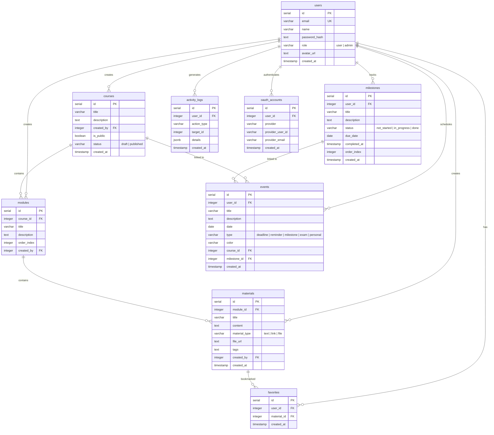

<!-- Hero banner — will be added when UI is ready -->

<p align="center">
  <b>Full-stack LMS capstone for SoftUni "Full Stack Apps with AI"</b>
</p>

<p align="center">
  <a href="https://nextjs.org/"></a>
  <a href="https://expo.dev/"></a>
  <a href="https://www.typescriptlang.org/"></a>
  <a href="https://orm.drizzle.team/"></a>
  <a href="https://neon.tech/"></a>
</p>

<p align="center">
  
  
  
  
</p>

<p align="center">
  <a href="#database-schema"></a>
  <a href="#progress-roadmap"></a>
  <a href="#quick-setup"></a>
  <a href="#project-details"></a>
</p>

## Live Demo

- Live Web App: `TBD` (deployment planned as final phase)
- Mobile Demo (Expo): local only — see [Quick Setup](#quick-setup)

<!-- Screenshots and animated previews will be added when UI is ready -->

## Progress Roadmap

`MVP delivery pulse: [######....] 75% (6/8 phases complete)`

| Phase | Scope | Status |
|---|---|---|
| Phase 0 | Monorepo bootstrap |  |
| Phase 1 | DB schema + Drizzle migrations (9 tables) |  |
| Phase 2 | Auth + JWT guards + Google OAuth |  |
| Phase 3 | Courses / modules / materials CRUD + favorites |  |
| Phase 4 | Profile + milestones + calendar + progress tracking |  |
| Phase 5 | Mobile app (3 screens) |  |
| Phase 6 | Deployment (Vercel/Netlify) |  |
| Phase 7 | Docs + demo polish |  |

## Database Schema

9 tables with foreign key relationships, cascade deletes, and unique constraints:



## Project Details

<details open>
  <summary><b>Project Story</b></summary>

StudyHub v2 is a full rewrite of StudyHub v1 with a modern full-stack architecture.
The goal is a rubric-first LMS that ships clean backend security, responsive web UI, and mobile parity.

**Why this is an adaptation instead of a brand-new concept:**
- The business logic is personally useful and has real practical value, so the rewrite focuses on turning an already validated idea into a more viable, maintainable, and production-ready product.
- I actively use the app to keep lesson notes and to plan the development of this capstone itself, which gives the project immediate practical value beyond the course requirement.
- Rebuilding the same domain with a completely different stack creates a direct comparison between two architectural approaches, which is valuable for the learning goals of this capstone.
- As StudyHub v1 grew, some files became too monolithic, and it was too risky to break them apart before the original submission. StudyHub v2 is also an intentional attempt to correct that mistake through better modularity and separation of concerns.
- That architectural lesson was already acknowledged in the StudyHub v1 README itself, where a post-demo refactor direction was explicitly planned for splitting larger files by responsibility. StudyHub v2 is where that intention is carried forward more deliberately from the start.
- Some interface patterns remain recognizable on purpose, but the implementation is fully rewritten and improved through the new technologies. This is adaptation and redesign, not automatic copying.

**Architecture Complexity Analogy:**
This project is architecturally equivalent to a medical data software (e.g., Mobile app for patient photos + Web portals for doctors/patients + Admin panel). It implements the same core pillars: multi-platform access, role-based security, and structured data hierarchy.
</details>

<details open>
  <summary><b>Architecture</b></summary>

### System Overview

```
┌─────────────────────────────────────────────────────┐
│                    Client Layer                      │
│  ┌──────────────────┐    ┌───────────────────────┐  │
│  │   Next.js Web    │    │   Expo Mobile (RN)    │  │
│  │   React + TS     │    │   Android / iOS       │  │
│  │   Tailwind CSS   │    │   3 screens           │  │
│  │   14 pages       │    │                       │  │
│  └────────┬─────────┘    └───────────┬───────────┘  │
│           │         REST API         │              │
└───────────┼──────────────────────────┼──────────────┘
            │                          │
┌───────────▼──────────────────────────▼──────────────┐
│                  Server Layer                        │
│  ┌──────────────────────────────────────────────┐   │
│  │         Next.js API Routes (25 endpoints)     │   │
│  │  Auth (JWT + Google OAuth) │ CRUD │ Admin     │   │
│  └──────────────────┬───────────────────────────┘   │
│                     │                                │
│  ┌──────────────────▼───────────────────────────┐   │
│  │           Drizzle ORM (TypeScript)             │   │
│  └──────────────────┬───────────────────────────┘   │
└─────────────────────┼───────────────────────────────┘
                      │
┌─────────────────────▼───────────────────────────────┐
│                  Data Layer                           │
│  ┌──────────────────────────────────────────────┐   │
│  │     Neon PostgreSQL (serverless, EU region)    │   │
│  │     9 tables │ migrations │ relationships      │   │
│  └──────────────────────────────────────────────┘   │
└─────────────────────────────────────────────────────┘
```

### Tech Stack

| Layer | Technology |
|---|---|
| Frontend Web | Next.js 15 + React 19 + TypeScript (strict) + Tailwind CSS |
| Backend API | Next.js API Routes — 25 RESTful endpoints |
| Database | Neon PostgreSQL (serverless) + Drizzle ORM + migrations |
| Auth | Custom JWT (jose, HS256, httpOnly cookies) + Google OAuth |
| Mobile | React Native + Expo SDK 54 |
| Monorepo | npm workspaces (`apps/web`, `apps/mobile`, `packages/shared`) |

### Authentication Flow

1. User submits credentials via `/login` or `/register`
2. Server validates, hashes password (bcryptjs), creates JWT (7-day expiry)
3. JWT stored in httpOnly cookie — no localStorage tokens
4. `middleware.ts` guards protected routes, checks admin role
5. API helpers `requireAuth()` / `requireAdmin()` enforce per-endpoint access
6. Google OAuth available as alternative login method

</details>

<details>
  <summary><b>Key Folders and Files</b></summary>

```
studyhub-v2/
├── apps/
│   ├── web/                          # Next.js web app + API backend
│   │   ├── app/
│   │   │   ├── api/                  # 25 REST API endpoints
│   │   │   │   ├── auth/             #   register, login, logout, me, password, avatar, google
│   │   │   │   ├── courses/          #   CRUD + nested modules
│   │   │   │   ├── modules/          #   CRUD + nested materials
│   │   │   │   ├── materials/        #   CRUD
│   │   │   │   ├── favorites/        #   create, list, remove
│   │   │   │   ├── milestones/       #   CRUD
│   │   │   │   ├── events/           #   CRUD
│   │   │   │   ├── dashboard/        #   aggregated stats
│   │   │   │   ├── admin/            #   users, materials, activity-logs
│   │   │   │   └── health/           #   health check
│   │   │   ├── login/                # Login page
│   │   │   ├── register/             # Register page
│   │   │   ├── dashboard/            # Main dashboard
│   │   │   ├── courses/[id]/         # Course detail + modules
│   │   │   ├── modules/[id]/         # Module detail + materials
│   │   │   ├── materials/[id]/       # Material view/edit
│   │   │   ├── profile/              # User profile
│   │   │   ├── progress/             # Milestones tracker
│   │   │   ├── calendar/             # Events calendar
│   │   │   ├── admin/                # Admin panel
│   │   │   ├── how-it-works/         # Landing info page
│   │   │   ├── contact/              # Contact page
│   │   │   └── forbidden/            # 403 page
│   │   ├── components/               # Reusable UI components
│   │   │   ├── ui/                   #   Base components (buttons, cards, etc.)
│   │   │   ├── admin/                #   Admin panel tabs
│   │   │   ├── home/                 #   Landing page sections
│   │   │   ├── dashboard/            #   Dashboard widgets
│   │   │   ├── course/               #   Course-related components
│   │   │   ├── materials/            #   Material editor/viewer
│   │   │   ├── calendar/             #   Calendar components
│   │   │   └── progress/             #   Milestone components
│   │   ├── lib/                      # Server utilities
│   │   │   ├── db.ts                 #   Neon + Drizzle connection
│   │   │   ├── jwt.ts                #   JWT sign/verify (jose)
│   │   │   ├── auth.ts               #   Password hash/verify (bcryptjs)
│   │   │   ├── api-utils.ts          #   requireAuth(), requireAdmin()
│   │   │   └── activity.ts           #   Activity logging helper
│   │   └── middleware.ts             # Route protection + role guards
│   │
│   └── mobile/                       # Expo React Native app
│       ├── app/
│       │   ├── _layout.tsx           #   Root layout + auth provider
│       │   ├── login.tsx             #   Login screen
│       │   ├── index.tsx             #   Courses list screen
│       │   └── course/[id].tsx       #   Course detail screen
│       └── lib/
│           └── auth-context.tsx      #   Auth state management
│
├── packages/
│   └── shared/                       # Shared TypeScript types/utils
│
├── drizzle/
│   ├── schema.ts                     # All 9 table definitions
│   └── migrations/                   # SQL migration files
│
├── docs/
│   ├── assignment.md                 # Course assignment requirements
│   ├── implementation-plan.md        # Development roadmap
│   ├── dev-log.md                    # Session-by-session dev log
│   ├── mobile-phone-testing-handoff.md  # Expo setup + troubleshooting
│   └── legacy-notes/                 # Notes from v1
│
├── drizzle.config.ts                 # Drizzle Kit configuration
├── package.json                      # Monorepo root (npm workspaces)
├── AGENTS.md                         # AI agent instructions
└── README.md
```

</details>

<details>
  <summary><b>Feature Scope</b></summary>

**Implemented:**
- JWT auth with httpOnly cookies + Google OAuth
- Roles (`user`, `admin`) with middleware + per-endpoint guards
- Courses -> modules -> materials hierarchy with full CRUD
- Favorites (bookmark materials) + activity logging
- Milestones tracking with status workflow (not started / in progress / done)
- Calendar with events (deadlines, reminders, exams, personal)
- Dashboard with aggregated stats
- Profile with avatar upload
- Landing page, How It Works, Contact
- 14 responsive web pages
- 3 mobile screens (login, courses list, course details)

**Planned:**
- **Admin Panel:** Full admin UI with user management, content moderation, and activity logs
- **File Storage (Cloudflare R2):** Upload PDFs and documents, convert PDF to notes and notes to PDF
- **Sharing & Permissions:** Share materials/notes between users with granular access
- **AI Integration:** Summarize/Quiz/Chat powered by Gemini API
- **Deployment:** Vercel/Netlify with serverless backend

</details>

<details>
  <summary><b>Screens</b></summary>

**Web (14 pages):**

| # | Route | Description |
|---|---|---|
| 1 | `/` | Landing page with animated hero |
| 2 | `/register` | User registration |
| 3 | `/login` | Login (credentials + Google OAuth) |
| 4 | `/dashboard` | Course overview + stats |
| 5 | `/courses/[id]` | Course detail with modules |
| 6 | `/modules/[id]` | Module detail with materials |
| 7 | `/materials/[id]` | Material view/edit |
| 8 | `/profile` | Edit name, avatar |
| 9 | `/progress` | Milestones tracker |
| 10 | `/calendar` | Events calendar |
| 11 | `/admin` | Admin panel |
| 12 | `/how-it-works` | Feature overview |
| 13 | `/contact` | Contact page |
| 14 | `/forbidden` | 403 access denied |

**Mobile (3 screens):**

| # | Screen | Description |
|---|---|---|
| 1 | Login | Credentials-based auth |
| 2 | Courses List | Browse all courses |
| 3 | Course Detail | View modules and materials |

</details>

<details>
  <summary><b>Database Tables</b></summary>

9 tables with relationships (minimum required: 4):

| # | Table | Purpose | Key relationships |
|---|---|---|---|
| 1 | `users` | User accounts + roles | Referenced by almost all tables |
| 2 | `courses` | Course containers | Created by user, contains modules |
| 3 | `modules` | Course sections | Belongs to course, contains materials |
| 4 | `materials` | Learning content | Belongs to module, can be favorited |
| 5 | `favorites` | Bookmarked materials | Links user to material (unique constraint) |
| 6 | `milestones` | Progress tracking | Belongs to user, linkable to events |
| 7 | `events` | Calendar entries | Belongs to user, optionally linked to course/milestone |
| 8 | `activity_logs` | Audit trail | Logs all user actions with JSON details |
| 9 | `oauth_accounts` | External auth providers | Links OAuth identity to user |

</details>

<details>
  <summary><b>API Endpoints (25)</b></summary>

**Auth (7):**
- `POST /api/auth/register` — create account
- `POST /api/auth/login` — login, returns JWT cookie
- `POST /api/auth/logout` — clear auth cookie
- `GET /api/auth/me` — current user profile
- `PUT /api/auth/me` — update profile
- `PUT /api/auth/password` — change password
- `POST /api/auth/avatar` — upload avatar
- `POST /api/auth/google` — Google OAuth login

**Courses (3):**
- `GET /api/courses` — list courses
- `POST /api/courses` — create course
- `GET/PUT/DELETE /api/courses/[id]` — course by id

**Modules (3):**
- `GET/POST /api/courses/[id]/modules` — list/create modules for course
- `GET/PUT/DELETE /api/modules/[id]` — module by id

**Materials (3):**
- `GET/POST /api/modules/[id]/materials` — list/create materials for module
- `GET/PUT/DELETE /api/materials/[id]` — material by id

**Favorites (2):**
- `GET /api/favorites` — list user favorites
- `POST/DELETE /api/favorites` — add/remove favorite

**Milestones (2):**
- `GET/POST /api/milestones` — list/create milestones
- `GET/PUT/DELETE /api/milestones/[id]` — milestone by id

**Events (2):**
- `GET/POST /api/events` — list/create events
- `GET/PUT/DELETE /api/events/[id]` — event by id

**Dashboard (1):**
- `GET /api/dashboard` — aggregated stats

**Admin (3):**
- `GET /api/admin/users` + `PUT/DELETE /api/admin/users/[id]` — user management
- `GET /api/admin/materials` + `DELETE /api/admin/materials/[id]` — content moderation
- `GET /api/admin/activity-logs` — audit log viewer

**Health (1):**
- `GET /api/health` — server health check

</details>

## Quick Setup

Requirements:
- Node.js 20+
- npm 10+

Install:
```bash
npm install
cp .env.example .env
```

Run web:
```bash
npm run dev:web
```
Open: `http://localhost:3000`

Run mobile (Android USB — recommended):
```bash
# Terminal 1: start web API
npm run dev:web
# Verify: http://localhost:3000/login should return 200

# Terminal 2: start Metro
npm --workspace @studyhub/mobile run start -- --localhost -c

# Terminal 3: reverse ports so the phone reaches localhost
adb reverse tcp:8081 tcp:8081
adb reverse tcp:3000 tcp:3000
adb reverse tcp:19000 tcp:19000
adb reverse tcp:19001 tcp:19001
adb reverse tcp:19002 tcp:19002

# Open in Expo Go on the phone:
# exp://127.0.0.1:8081
```

> **Prerequisites:** USB debugging ON, USB mode = File transfer (MTP), `adb devices` shows your device.
>
> **If it doesn't start:** check `netstat -ano | findstr :3000` — if port 3000 is taken by a stale process, kill it and restart `dev:web`.
>
> **Full troubleshooting guide:** [docs/mobile-phone-testing-handoff.md](docs/mobile-phone-testing-handoff.md)

Alternative mobile connection modes:
```bash
npm run dev:mobile:tunnel
npm run dev:mobile:lan
npm run dev:mobile:usb
```

## Demo Credentials

| Role | Email | Password |
|---|---|---|
| Admin | admin@studyhub.dev | admin123 |
| User | user@studyhub.dev | user123 |

## v1 -> v2 Transformation

| Topic | StudyHub v1 | StudyHub v2 |
|---|---|---|
| Frontend | Vanilla JS | React + Next.js + TypeScript |
| Backend | Supabase-centric | Next.js API + Neon + Drizzle |
| Auth | Supabase Auth | Custom JWT + Google OAuth |
| Mobile | None | React Native + Expo |
| Database | 6 tables | 9 tables with richer relationships |
| Structure | Single app, monolithic files | Monorepo + modular components |

## Notes

- Legacy repository is used only as visual/logical reference and as a comparison baseline for the rewrite.
- The business logic is intentionally preserved, but the implementation is fully rebuilt for the new stack and architecture.
- No Vanilla JS code is copied into this project.
