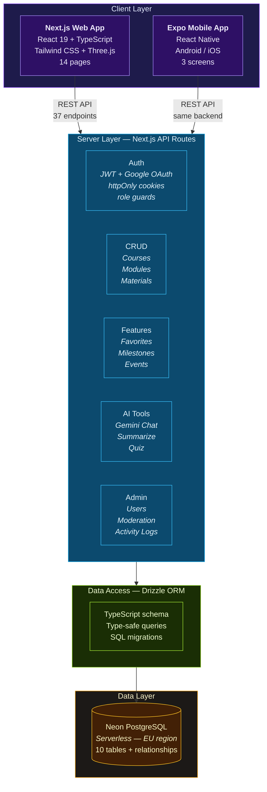
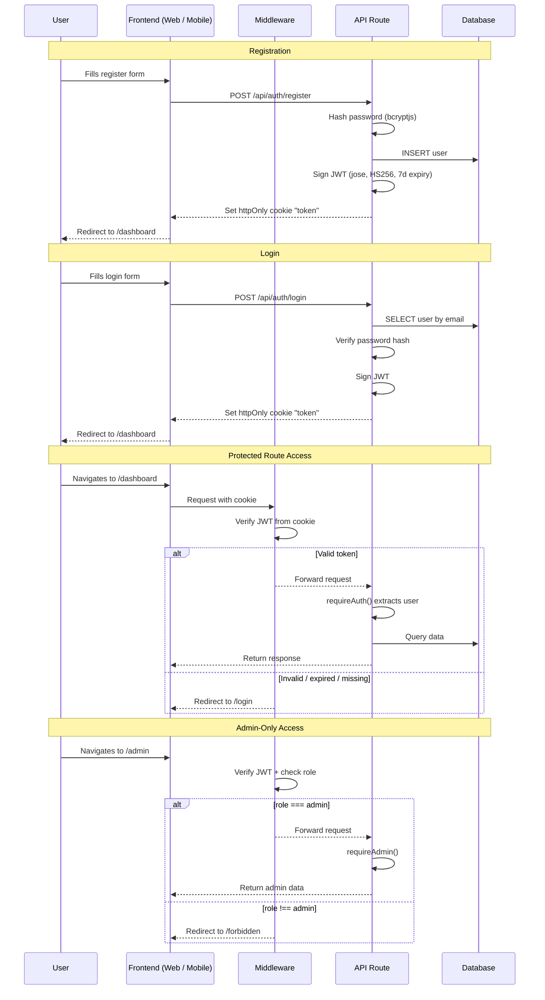
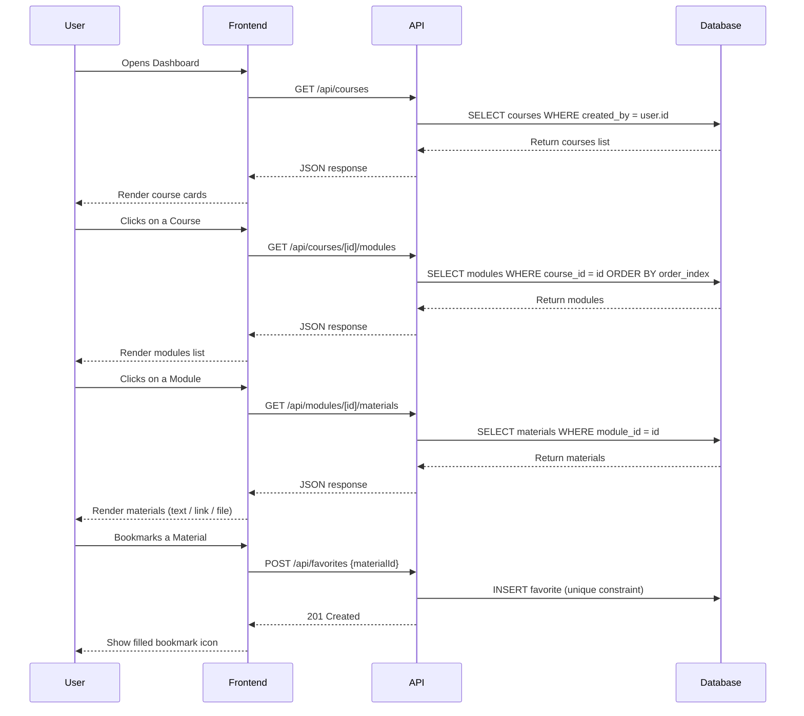
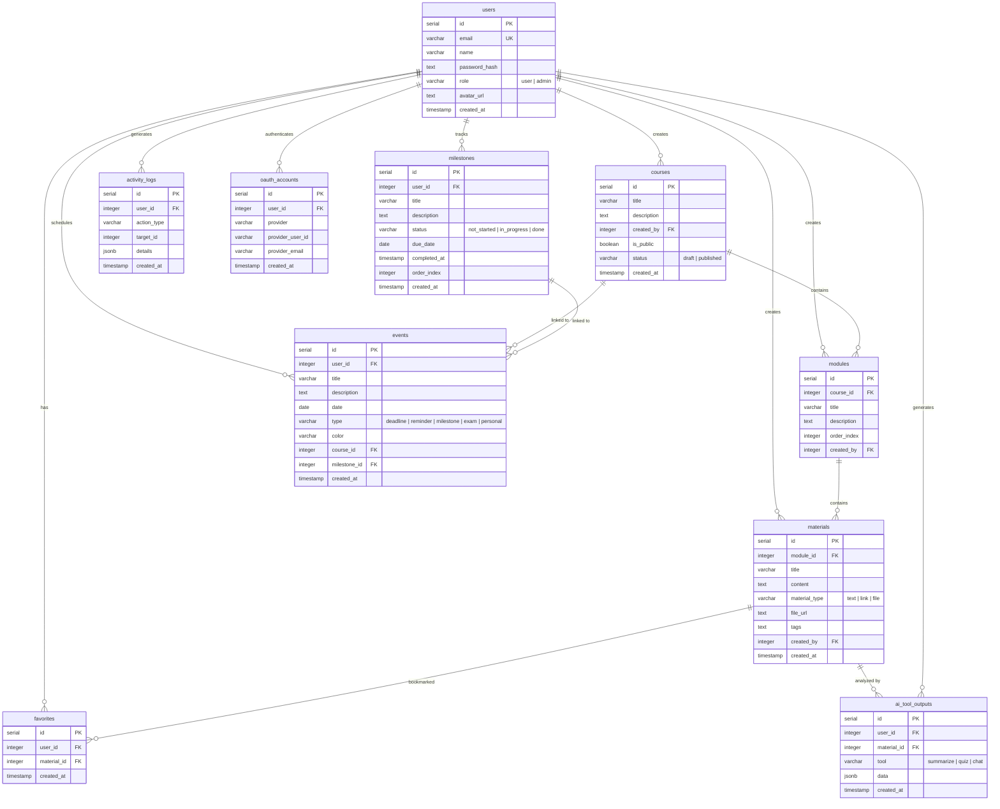

<div align="center">
  
</div>

<p align="center">
  <b>Full-stack LMS capstone for SoftUni "Full Stack Apps with AI"</b>
</p>

<p align="center">
  <a href="https://nextjs.org/"></a>
  <a href="https://expo.dev/"></a>
  <a href="https://www.typescriptlang.org/"></a>
  <a href="https://orm.drizzle.team/"></a>
  <a href="https://neon.tech/"></a>
</p>

<p align="center">
  
  
  
  
  
  
  
</p>

<p align="center">
  <a href="#system-architecture"></a>
  <a href="#database-schema"></a>
  <a href="#user-roles"></a>
  <a href="#demo-walkthrough"></a>
  <a href="#api-endpoints-37"></a>
</p>

---

## Live Demo

- Live Web App: `TBD` (deployment planned as final phase)
- Mobile Demo (Expo): local only — see [Quick Setup](#-quick-setup)

Demo credentials: see [Demo Credentials](#demo-credentials)

<!-- Screenshots / GIF recordings of real UI will be added after UI polish -->

---

## About the Project

StudyHub v2 is a full rewrite of [StudyHub v1](https://github.com/mariva565/Test-Capstone-Project-StudyHub) (Vanilla JS + Supabase) with a modern full-stack architecture: **Next.js + Expo monorepo**.

The app is a personal **Learning Management System (LMS)** — a structured electronic notebook where users organize study materials hierarchically (`Courses -> Modules -> Materials`), track progress with milestones, and plan with a calendar.

**Why a rewrite instead of a new concept:**
- The business logic is personally useful — I actively use StudyHub to organize my own SoftUni notes and plan this capstone.
- Rebuilding the same domain with a completely different stack creates a direct comparison between two architectural approaches.
- StudyHub v1 had monolithic files that were too risky to refactor before submission. v2 corrects that from day one with modular components.
- Some interface patterns remain recognizable on purpose, but the implementation is fully rewritten. This is adaptation and redesign, not copying.

---

## Progress Roadmap

| Phase | Scope | Status |
|---|---|---|
| Phase 0 | Monorepo bootstrap (npm workspaces) |  |
| Phase 1 | DB schema + Drizzle migrations (10 tables) |  |
| Phase 2 | Auth (JWT + Google OAuth + role guards) |  |
| Phase 3 | Courses / modules / materials CRUD + favorites |  |
| Phase 4 | Profile + milestones + calendar + progress tracking |  |
| Phase 5 | Mobile app (CRUD flows + persisted React Query cache) |  |
| Phase 6 | Admin panel (user management, moderation, logs) |  |
| Phase 7 | AI study tools (Gemini chat, summarize, quiz) |  |
| Phase 8 | UI polish (landing, how-it-works, contact, animations) |  |
| Phase 9 | File storage (Cloudflare R2 — PDF upload, export) |  |
| Phase 10 | Deployment (Vercel/Netlify) |  |

---

<p align="center">
  
</p>

## System Architecture

### Overview



### Tech Stack

| Layer | Technology |
|---|---|
| Frontend Web | Next.js 15 + React 19 + TypeScript (strict) + Tailwind CSS |
| Backend API | Next.js API Routes — 37 RESTful endpoints |
| Database | Neon PostgreSQL (serverless) + Drizzle ORM + SQL migrations |
| Auth | Custom JWT (jose, HS256, httpOnly cookies) + Google OAuth |
| Mobile | React Native + Expo SDK 54 + TanStack React Query + AsyncStorage persistence |
| Monorepo | npm workspaces (`apps/web`, `apps/mobile`, `packages/shared`) |

---

## Authentication Flow



---

## Content Access Flow



---

## User Roles

### Student (role: `user`)

| Action | Where |
|---|---|
| Register / login / logout | `/register`, `/login` |
| Create, edit, delete own courses | `/dashboard` |
| Create modules inside own courses | `/courses/[id]` |
| Create, edit, delete materials (text, link, file) | `/materials/[id]` |
| Bookmark materials as favorites | Any material card |
| Track progress with milestones | `/progress` |
| Plan with calendar events | `/calendar` |
| Edit profile and avatar | `/profile` |

### Admin (role: `admin`)

Everything a student can do, plus:

| Action | Where |
|---|---|
| View all users | `/admin` |
| Change user roles (user / admin) | `/admin` |
| Delete users (with self-protection) | `/admin` |
| View and delete any material | `/admin` |
| View activity logs (audit trail) | `/admin` |

Admin cannot delete themselves or change their own role (self-protection enforced server-side).

---

## Database Schema

10 tables with foreign key relationships, cascade deletes, and unique constraints (minimum required: 4):



### Table Descriptions

| # | Table | Purpose | Key relationships |
|---|---|---|---|
| 1 | `users` | User accounts with email, hashed password, role | Referenced by almost all tables via `created_by` or `user_id` |
| 2 | `courses` | Top-level containers for learning content | Created by user; contains modules |
| 3 | `modules` | Ordered sections within a course | Belongs to course (cascade delete); contains materials |
| 4 | `materials` | Learning content — text notes, links, or files | Belongs to module (cascade delete); can be favorited |
| 5 | `favorites` | Bookmarked materials per user | Unique constraint on (user_id, material_id) prevents duplicates |
| 6 | `milestones` | Personal progress goals with status workflow | not_started -> in_progress -> done; linkable to calendar events |
| 7 | `events` | Calendar entries with type and color | Optionally linked to a course or milestone |
| 8 | `activity_logs` | Audit trail for all user actions | Stores action_type + structured JSON details |
| 9 | `ai_tool_outputs` | Saved AI analysis results (summaries, quizzes) | Per user + material; indexed for fast lookup |
| 10 | `oauth_accounts` | External auth provider identities | Links Google OAuth to user; unique on (provider, provider_user_id) |

---

## Screens

### Web — 14 pages

| # | Route | Description | Auth |
|---|---|---|---|
| 1 | `/` | Landing page with animated hero and feature sections | Public |
| 2 | `/how-it-works` | Feature overview with visual explanations | Public |
| 3 | `/contact` | Contact form | Public |
| 4 | `/register` | User registration | Public |
| 5 | `/login` | Login (email/password + Google OAuth) | Public |
| 6 | `/dashboard` | Course cards + aggregated stats | Protected |
| 7 | `/courses/[id]` | Course detail — modules list with CRUD | Protected |
| 8 | `/modules/[id]` | Module detail — materials list with CRUD | Protected |
| 9 | `/materials/[id]` | Material view and edit (text, link, file) | Protected |
| 10 | `/profile` | Edit name, avatar upload | Protected |
| 11 | `/progress` | Milestones tracker with status workflow | Protected |
| 12 | `/calendar` | Calendar with events (deadlines, reminders, exams) | Protected |
| 13 | `/admin` | Admin panel — users, materials, activity logs | Admin only |
| 14 | `/forbidden` | 403 access denied page | Auto-redirect |

### Mobile — current flows

| # | Screen | Description |
|---|---|---|
| 1 | Login | Email/password authentication against the same API |
| 2 | Register | Account creation from mobile |
| 3 | Courses (tab) | Course list with create/edit/delete actions |
| 4 | Profile (tab) | Profile details + edit name + logout |
| 5 | Create Course | Add a new course |
| 6 | Course Detail | Manage modules inside a selected course |
| 7 | Edit Course | Update course title/description |
| 8 | Add Module | Create module in a course |
| 9 | Module Workspace | Manage materials with search/type filters |
| 10 | Edit Module | Update module title/description |
| 11 | Add Material | Create note/link/file/video material |
| 12 | Material Detail | View material content, tags, and URL/file link |
| 13 | Edit Material | Update material content/type/tags/url |

The mobile app connects to the **same Next.js backend** — no separate API needed.

### Mobile data layer (React Query + apiFetch cache)

- `@tanstack/react-query` powers server-state fetching in key mobile screens.
- `PersistQueryClientProvider` + AsyncStorage persistence keep query cache between app restarts.
- Query keys and invalidation helpers are centralized in `apps/mobile/lib/query-keys.ts`.
- Delete flows use optimistic updates; create/edit/delete flows invalidate related queries.
- `apiFetch` remains the request layer (including existing AsyncStorage fallback cache + normalized API/network errors), now complemented by React Query state management.

---

## API Endpoints (37)

### Auth (8 endpoints)

| Method | Endpoint | Description |
|---|---|---|
| `POST` | `/api/auth/register` | Create account (email, name, password) |
| `POST` | `/api/auth/login` | Login — returns JWT in httpOnly cookie |
| `POST` | `/api/auth/logout` | Clear auth cookie |
| `GET` | `/api/auth/me` | Get current user profile |
| `PUT` | `/api/auth/me` | Update profile (name, etc.) |
| `PUT` | `/api/auth/password` | Change password |
| `POST` | `/api/auth/avatar` | Upload avatar image |
| `POST` | `/api/auth/google` | Google OAuth login |

### Content CRUD (8 endpoints)

| Method | Endpoint | Description |
|---|---|---|
| `GET` | `/api/courses` | List user's courses |
| `POST` | `/api/courses` | Create course |
| `GET/PUT/DELETE` | `/api/courses/[id]` | Course by id |
| `GET/POST` | `/api/courses/[id]/modules` | List / create modules for course |
| `GET/PUT/DELETE` | `/api/modules/[id]` | Module by id |
| `GET/POST` | `/api/modules/[id]/materials` | List / create materials for module |
| `GET/PUT/DELETE` | `/api/materials/[id]` | Material by id |

### Features (7 endpoints)

| Method | Endpoint | Description |
|---|---|---|
| `GET` | `/api/favorites` | List user's bookmarked materials |
| `POST/DELETE` | `/api/favorites` | Add / remove favorite |
| `GET/POST` | `/api/milestones` | List / create milestones |
| `GET/PUT/DELETE` | `/api/milestones/[id]` | Milestone by id |
| `GET/POST` | `/api/events` | List / create calendar events |
| `GET/PUT/DELETE` | `/api/events/[id]` | Event by id |
| `GET` | `/api/dashboard` | Aggregated stats (courses, materials, favorites count) |

### AI Tools (3 endpoints)

| Method | Endpoint | Description |
|---|---|---|
| `POST` | `/api/ai/chat` | Gemini-powered chat about material content |
| `POST` | `/api/ai/tools` | AI analysis tools (summarize, quiz, explain) |
| `GET/POST/DELETE` | `/api/materials/[id]/ai-outputs` | Saved AI results per material |

### Admin (11 endpoints)

| Method | Endpoint | Description |
|---|---|---|
| `GET` | `/api/admin/users` | List all users (admin only) |
| `PUT/DELETE` | `/api/admin/users/[id]` | Change role / delete user (admin only) |
| `GET` | `/api/admin/courses` | List all courses for moderation |
| `DELETE` | `/api/admin/courses/[id]` | Delete any course |
| `POST` | `/api/admin/courses/bulk-delete` | Bulk delete courses |
| `GET` | `/api/admin/modules` | List all modules for moderation |
| `DELETE` | `/api/admin/modules/[id]` | Delete any module |
| `POST` | `/api/admin/modules/bulk-delete` | Bulk delete modules |
| `GET` | `/api/admin/materials` | List all materials for moderation |
| `DELETE` | `/api/admin/materials/[id]` | Delete any material |
| `POST` | `/api/admin/materials/bulk-delete` | Bulk delete materials |
| `GET` | `/api/admin/activity-logs` | View audit trail (admin only) |
| `GET` | `/api/admin/activity-stats` | Activity statistics and charts |
| `GET` | `/api/admin/stats` | Dashboard overview stats |
| `GET` | `/api/health` | Server health check |

---

## Security Baseline

| Measure | Implementation |
|---|---|
| Password hashing | bcryptjs (server-side only) |
| JWT tokens | jose library, HS256, 7-day expiry, httpOnly cookie |
| Route protection | `middleware.ts` — validates JWT on every protected request |
| Admin guards | `requireAdmin()` — server-side role check per endpoint |
| Self-protection | Admin cannot delete self or change own role |
| No client-side tokens | JWT never stored in localStorage — only httpOnly cookie |
| Input validation | Server-side validation before database operations |
| No secrets in errors | Error payloads never expose stack traces or sensitive data |
| TypeScript strict | Catches type errors at compile time across the entire codebase |

---

## Demo Walkthrough

> Step-by-step guide for testing the app (for jury review).

### As a Student

1. **Register** — go to `/register`, create a new account
2. **Dashboard** — see the empty dashboard, create your first course
3. **Course** — open the course, add a module
4. **Module** — open the module, add materials (text note, link)
5. **Favorites** — bookmark a material, see it highlighted
6. **Progress** — go to `/progress`, create a milestone, change its status
7. **Calendar** — go to `/calendar`, create an event (deadline, exam, reminder)
8. **Profile** — go to `/profile`, change your name and upload an avatar

### As an Admin

1. **Login** with admin credentials (see [Demo Credentials](#demo-credentials))
2. **Admin Panel** — go to `/admin`
3. **Users tab** — see all registered users, change a user's role
4. **Materials tab** — see all materials across all users
5. **Activity Logs tab** — see the audit trail of all actions

### On Mobile

1. **Connect** phone via USB (see [Quick Setup](#-quick-setup))
2. **Login** — same credentials as web
3. **Courses tab** — browse courses, pull-to-refresh, open CRUD actions
4. **Course Detail** — manage modules, add/edit/delete
5. **Module Workspace** — manage materials with search/type filters
6. **Material Detail** — open links/files and verify tags/content
7. **Profile tab** — edit user name and logout

---

## Demo Credentials

| Role | Email | Password |
|---|---|---|
| Admin | admin@studyhub.dev | admin123 |
| User | user@studyhub.dev | user123 |

---

## Key Folders and Files

```
studyhub-v2/
├── apps/
│   ├── web/                          # Next.js web app + API backend
│   │   ├── app/
│   │   │   ├── api/                  # 37 REST API endpoints
│   │   │   │   ├── auth/             #   register, login, logout, me, password, avatar, google
│   │   │   │   ├── courses/          #   CRUD + nested modules
│   │   │   │   ├── modules/          #   CRUD + nested materials
│   │   │   │   ├── materials/        #   CRUD + AI outputs
│   │   │   │   ├── favorites/        #   create, list, remove
│   │   │   │   ├── milestones/       #   CRUD
│   │   │   │   ├── events/           #   CRUD
│   │   │   │   ├── ai/              #   Gemini chat + analysis tools
│   │   │   │   ├── dashboard/        #   aggregated stats
│   │   │   │   ├── admin/            #   users, courses, modules, materials, logs, stats
│   │   │   │   └── health/           #   health check
│   │   │   ├── login/                # Login page
│   │   │   ├── register/             # Register page
│   │   │   ├── dashboard/            # Main dashboard
│   │   │   ├── courses/[id]/         # Course detail + modules
│   │   │   ├── modules/[id]/         # Module detail + materials
│   │   │   ├── materials/[id]/       # Material view/edit
│   │   │   ├── profile/              # User profile
│   │   │   ├── progress/             # Milestones tracker
│   │   │   ├── calendar/             # Events calendar
│   │   │   ├── admin/                # Admin panel
│   │   │   ├── how-it-works/         # Landing info page
│   │   │   ├── contact/              # Contact page
│   │   │   └── forbidden/            # 403 page
│   │   ├── components/               # Reusable UI components
│   │   │   ├── ui/                   #   Base components (buttons, cards, modals, etc.)
│   │   │   ├── admin/                #   Admin panel tabs + management
│   │   │   ├── home/                 #   Landing page sections
│   │   │   ├── how-it-works/         #   How It Works page sections + 3D scenes
│   │   │   ├── contact/              #   Contact page + aurora background
│   │   │   ├── dashboard/            #   Dashboard widgets
│   │   │   ├── course/               #   Course-related components
│   │   │   ├── materials/            #   Material editor/viewer
│   │   │   ├── chat/                 #   AI chat widget + tools panel
│   │   │   ├── calendar/             #   Calendar components
│   │   │   └── progress/             #   Milestone components
│   │   ├── lib/                      # Server utilities
│   │   │   ├── db.ts                 #   Neon + Drizzle connection
│   │   │   ├── jwt.ts                #   JWT sign/verify (jose)
│   │   │   ├── auth.ts               #   Password hash/verify (bcryptjs)
│   │   │   ├── google.ts             #   Google OAuth token verification
│   │   │   ├── api-utils.ts          #   requireAuth(), requireAdmin()
│   │   │   └── activity.ts           #   Activity logging helper
│   │   └── middleware.ts             # Route protection + role guards
│   │
│   └── mobile/                       # Expo React Native app
│       ├── app/
│       │   ├── _layout.tsx           #   Root layout + auth provider
│       │   ├── login.tsx             #   Login screen
│       │   ├── index.tsx             #   Courses list screen
│       │   └── course/[id].tsx       #   Course detail screen
│       └── lib/
│           └── auth-context.tsx      #   Auth state management
│
├── packages/
│   └── shared/                       # Shared TypeScript types/utils
│
├── drizzle/
│   ├── schema.ts                     # All 10 table definitions
│   └── migrations/                   # SQL migration files (committed)
│
├── docs/
│   ├── assignment.md                 # Course assignment requirements
│   ├── implementation-plan.md        # Development roadmap
│   ├── dev-log.md                    # Session-by-session dev log
│   ├── mobile-phone-testing-handoff.md  # Expo setup + troubleshooting
│   └── legacy-notes/                 # Reference notes from v1
│
├── drizzle.config.ts                 # Drizzle Kit configuration
├── package.json                      # Monorepo root (npm workspaces)
├── AGENTS.md                         # AI agent instructions
└── README.md
```

---

## Quick Setup

### Requirements

- Node.js 20+
- npm 10+

### Install

```bash
npm install
cp .env.example .env
```

### AI env note (Gemini)

- The web AI routes (`/api/ai/chat`, `/api/ai/tools`) read `GEMINI_API_KEY` from `apps/web/.env` in local development.
- The root `.env` may still be empty for `GEMINI_API_KEY` without breaking local web AI, as long as `apps/web/.env` is configured.
- For production, set `GEMINI_API_KEY` in your deployment environment variables (Vercel/Netlify).

If `npm install --workspace ...` fails with the npm/arborist error `Cannot read properties of null (reading 'location')`, install mobile-only dependencies from `apps/mobile`:

```bash
cd apps/mobile
npm install --workspaces=false <package-name>
```

### Run Web

```bash
npm run dev:web
```
Open: `http://localhost:3000`

### Run Mobile (Android USB — recommended)

```bash
# Terminal 1: start web API
npm run dev:web
# Verify: http://localhost:3000/login should return 200

# Option A (recommended): helper script does ADB reverse + Metro
npm run dev:mobile:usb

# Option B (manual): start Metro + run ADB reverse yourself
# npm --workspace @studyhub/mobile run start -- --localhost -c
# adb reverse tcp:8081 tcp:8081
# adb reverse tcp:3000 tcp:3000
# adb reverse tcp:19000 tcp:19000
# adb reverse tcp:19001 tcp:19001
# adb reverse tcp:19002 tcp:19002

# Open in Expo Go on the phone:
# exp://127.0.0.1:8081
```

> **Prerequisites:** USB debugging ON, USB mode = File transfer (MTP), `adb devices` shows your device.
>
> **If it doesn't start:** check `netstat -ano | findstr :3000` — if port 3000 is taken by a stale process, kill it and restart `dev:web`.
>
> **Full troubleshooting guide:** [docs/mobile-phone-testing-handoff.md](docs/mobile-phone-testing-handoff.md)

Alternative mobile connection modes:
```bash
npm run dev:mobile:tunnel
npm run dev:mobile:lan
npm run dev:mobile:usb
```

---

## v1 -> v2 Transformation

| Topic | StudyHub v1 | StudyHub v2 |
|---|---|---|
| Frontend | Vanilla JS + Bootstrap | React + Next.js + TypeScript + Tailwind |
| Backend | Supabase (BaaS) | Next.js API Routes (custom) |
| Auth | Supabase Auth (GoTrue) | Custom JWT + Google OAuth |
| Database | Supabase PostgreSQL (6 tables) | Neon PostgreSQL + Drizzle ORM (10 tables) |
| Mobile | None | React Native + Expo + tabs/CRUD flows + persisted React Query cache |
| File structure | Single app, monolithic files | Monorepo + modular components (<300 LOC each) |
| Deployment | Netlify + Vercel (dual) | Planned: Vercel |
| Security | RLS + CSP + MFA (partial) | JWT guards + middleware + role-based endpoints |

---

## Planned Features

| Feature | Description | Status |
|---|---|---|
| Cloudflare R2 Storage | Upload PDFs and documents, avatar file storage | Planned |
| Sharing & Permissions | Share materials/notes between users with access control | Planned |
| Forgot Password | Email-based password reset flow with secure tokens | Planned |
| Deployment | Live production deploy on Vercel/Netlify | Final phase |

---

<div align="center">
  <strong>Made with ❤️ for the <a href="https://softuni.bg">SoftUni</a> "Full Stack Apps with AI" capstone.</strong>
</div>


